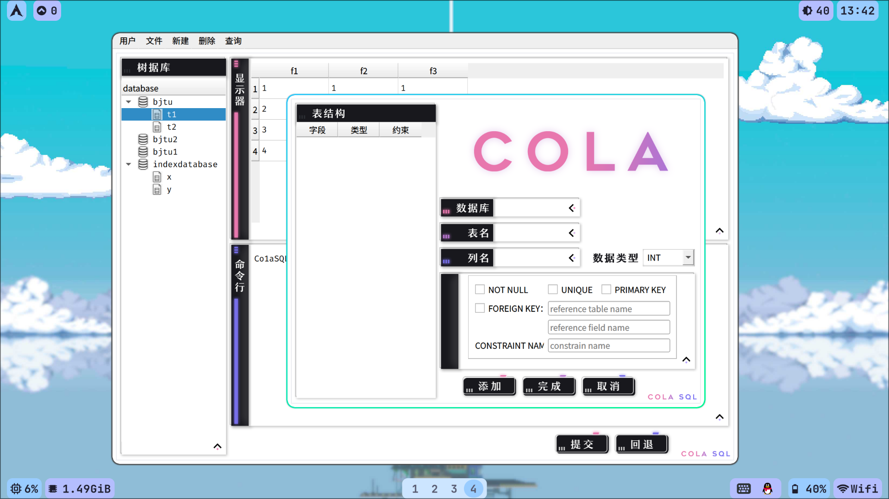

# Co1aSQL

> 2023-BJTU-DBMS-Project
>
> 北京交通大学软件学院 2023年春季 实训课项目 数据库管理系统

### 1. 简介

#### 1.1 软件介绍

* 软件名称：**Co1aSQL** —— 数据库管理系统
* 我们需要实现一个数据库管理系统，支持数据库的创建、数据库表的管理、记录的添加与查询、完整性 约束的实现，索引的创建与实现，多用户等功能。
* 数据库管理系统是一种操纵和管理数据库的大型软件，用于建立、使用和维护数据库。它对数据库进行 统一的管理和控制，以保证数据库的安全性和完整性。用户通过数据库管理系统访问数据库中的数据， 数:据库管理员也通过数据库管理系统进行数据库的维护工作。它可使多个应用程序和用户用不同的方法 在同时或不同时刻去建立，修改和询问数据库。
* 我们也支持用户使用SQL语句来控制数据库，包括DDL、DML、DCL，供用户定义数据库的模式结构与 权限约束，实现对数据的追加、删除等操作。
* 项目结构：

#### 1.2 基本功能

* 创建、删除数据库
* 创建、修改、删除表
* 插入、更新、查询、删除记录
* 三种数据类型：int, float, string
* 数据库文件

#### 1.3 拓展功能

* SQL脚本文件
* 复杂Select语句
* 数据持久化/事务管理
* 基于无旋Treap的索引
* 完整性管理（主键、外键、UNIQUE、NOT NULL、DEFAULT）
* 安全性管理（用户、权限）
* GUI点击修改记录

#### 1.4 结题报告

* [结题报告](./document/FinalDocument.md)

***

### 2. 构建与使用

#### 2.1 项目版本
* gcc 13.1.1
  * c++17
* qt 5.15.9
* cmake 3.26.3
* qmake 3.1
#### 2.2 构建CLI
```
cd cmd
cmake -Bbuild
make -Cbuild -j8
```
#### 2.3 启动CLI
```
build/colasql admin 123456;
```
#### 2.4 构建GUI
```
cd gui/ColaSqlGui
qmake -o build/Makefile ColaSqlGui.pro
make -Cbuild -j8
```
#### 2.5 启动GUI
```
build/ColaSqlGui
```
#### 2.6 FAQ

* 有关 `#include\<filemanager\>` 的编译错误
  * gcc在c++17中支持了 `filemanager` 库，但qt5在c++17中只支持 `experimental/filemanager`，需要根据环境具体决定。可以在 `file/src/filemanager.cpp` 中修改对应内容。

***

### 3. GUI展示




***

### 4. SQL语法

#### 4.1 基本约定

* Co1aSQL 支持的SQL语法，均为 **大小写不敏感**。
* Co1aSQL 在预处理SQL语句时，会自动将所有的小括号和逗号替换为空格，以尽可能兼容标准SQL。

#### 4.2 用户

* 登入数据库

  ```sql
  colasql 用户名 密码
  #管理员用户名admin，密码colasql
  LOGIN 用户名 密码;
  ```
  
* 创建用户

  ```sql
  CREATE USER 用户名 密码;
  #所有用户默认拥有数据库的查询权、创建权，只对自己创建的数据库有删除权
  #创建用户不需要任何权限，但授予权限只能授予自己拥有的权限
  #其它说明见下
  ```
  
* 修改用户权限

  ```sql
  GRANT USER 用户名 数据库名 表名 权限名;
  #数据库名和表名都不能为"*"，对某个特定的数据库的表授予权限。
  
  GRANT USER 用户名 数据库名 权限名;
  #数据库名为"*"，对所有数据库的所有表授予权限(当前用户拥有该数据库的权限,仅admin可用)。
  #数据库名不为"*"时，若为表级权限则授予该数据库里所有表的表级权限(当前用户需拥有授权的所有权限)，若为数据库级权限则授予该数据库的数据库级权限(当前用户需拥有该权限)。
  ```
  
  * 权限名
  
    ```sql
    #表级权限
    SELECT
    DELETE
    INSERT
    UPDATE
    INDEX
    ALTER
    
    #数据库级权限
    CREATE
    DROP
    
    #ALL表示以上所有权限,仅数据库管理员(admin)可用
    #ALL
    ```
  
* 删除用户（需要管理员权限）

  ```sql
  DROP USER 用户名;
  ```

#### 4.3 数据类型

* ```sql
  int    # 42位整数，如 1, 14, 514
  float  # 42位浮点数，如 1.0, 5.1, 2
  string # 字符串，如 "dbms", "2002-10-12"
  ```

#### 4.4 数据库

* 创建数据库（需要管理员权限）

  ```sql
  CREATE DATABASE 数据库名;
  ```

* 删除数据库（需要管理员权限）

  ```sql
  DROP DATABASE 数据库名;
  ```

* 使用数据库

  ```sql
  USE 数据库名;
  ```
  
* 显示所有数据库

  ```sql
  SHOW DATABASES;
  ```

#### 4.5 表

* 创建表(需要CREATE权限)

  ```sql
  CREATE TABLE 表名
    列名1 类型1
    列名2 类型2
    ...
    
    约束条件1
    约束条件2
    ...
  ;
  ```

  * 约束条件语法
  
    ```sql
    CONSTRAINT 约束名 PRIMARY KEY 列名;                # 指定主键
    CONSTRAINT 约束名 FOREIGN KEY 列名 REFERENCES 表名2 列名2; # 指定外键，该列 参考 表2的列2
    CONSTRAINT 约束名 UNIQUE 列名;                   # 指定该列值不可重复（未指定时，默认可重）
    CONSTRAINT 约束名 NOT NULL 列名;                 # 指定该列非空（未指定时，默认可空）
    CONSTRAINT 约束名 DEFAULT 列名 值;               # 指定该列默认值（未指定时，默认值为NULL）
    ```
  
* 删除表(需要DROP权限)

  ```sql
  DROP TABLE 表名;
  ```

* 修改表(需要ALTER权限)

  ```sql
  ALTER TABLE 表名 ADD 列名 类型;
  ALTER TABLE 表名 DROP 列名;
  ALTER TABLE 表名 MODIFY 列名 类型;
  ALTER TABLE 表名 约束条件;
  ALTER TABLE 表名 DELETE 约束条件名;
  ```

  * 约束条件语法见上文
  * 约束条件名可以通过“查看表结构”语句来查看。

* 查看表结构(需要SELECT权限)

  ```sql
  DESC TABLE 表名;
  ```
  
* 显示所有表

  ```sql
  SHOW TABLES;
  ```

* 索引相关

  ```sql
  CREATE INDEX ON 表名 列名1 列名2 ...;
  ```

  * 以上述列名为关键字建立索引，在Select时Where列需为此处列的前缀才可以触发索引。
  
* 查看约束
  ```sql
  SHOW CONSTRAINTS;
  SHOW CONSTRAINT ON 表名;
  ```
  

#### 4.6 记录

* 插入记录

  ```sql
  INSERT INTO 表名 列名1 列名2 列名3 ... VALUES 值1 值2 值3 ...;
  ```

* 删除记录

  ```sql
  DELETE FROM 表名 [WHERE 筛选条件1 筛选条件2 ...];
  ```
  
  * 筛选条件语法
  
    ```sql
    列名 = 值
    ```
    
    * **筛选条件'='左右必须要包含空格**，否则会产生解析错误
  
* 选择记录

  ```sql
  SELECT 列名1 列名2 列名3 ...
  FROM 表名1 [NATURAL JOIN 表名2 ...]
  [WHERE 筛选条件1 筛选条件2 ...]
  [ORDER BY 列名1 列名2 ...];
  ```

* 更新记录

  ```sql
  UPDATE 表名 SET 列名1 = 值1 [列名2 = 值2 ...]
  [WHERE 筛选条件1 筛选条件2 ...];
  ```

#### 4.7 文件

* 储存 & 提交

  ```mysql
  SAVE;
  COMMIT;
  ```

* 回滚 & 读取

  ```mysql
  READ;
  ROLLBACK;
  ```

#### 4.8 Co1aSQL脚本执行

* 执行Co1aSQL脚本
  * ```
    RUN path/to/directory/script.colasql
    ```
    
    * 注意！此处不能在语句末尾加 `;`，否则会解析失败！

#### 4.9 关键字

* `NULL` 为Co1aSQL关键字，若占用，则不一定能得到预期结果

***

### 5. C++函数接口

#### 5.1 基本约定

* 异常
  * 不使用异常，而是使用 函数返回值 来表示执行状态，用 assert断言 来处理一些重大异常。
  * 若函数返回值为0，则表示操作成功；若函数返回值不为0，则表示操作失败，函数返回值表示失败原因；
* 此处只规定接口的大致形式，细节不做规定，可 **自由发挥**。
  * 比如，可以把以下接口置于不同类中；
  * 比如，可以让 使用数据库(登录)方法 返回一个 数据库对象，通过该对象来操作数据库。

#### 5.2 数据载体

* ```c++
  // 属性（字段）
  std::pair<std::string, std::string> field;
  std::unordered_map<std::string, std::any> records;
  
  // 约束条件
  Class Constraint {};
  Class PrimaryKeyConstraint: public Constraint {};
  Class ForeignKeyConstraint: public Constraint {};
  Class UniqueConstraint: public Constraint {};
  Class NotNullConstraint: public Constraint {};
  Class DefaultConstraint: public Constraint {};
  ```

#### 5.3 用户

* ```c++
  // 创建用户（需要管理员权限）
  int CreateAccount(std::string accountName,
                    std::string password,
                    bool ownAllDatabases,
                    std::string databaseName,
                    int authority);
  
  // 删除用户（需要管理员权限）
  int DeleteAccount(std::string accountName);
  
  // 修改用户权限
  int GrantAccount(std::string accountName,
                   bool ownAllDatabases,
                   std::string databaseName,
                   int authority);
  ```

#### 5.4 数据库

* ```c++
  // 创建数据库（需要管理员权限）
  int CreateDatabase(std::string databaseName);
  
  // 删除数据库（需要管理员权限）
  int DeleteDatabase(std::string databaseName);
  
  // 使用数据库 —— 该函数会对其他函数产生影响
  int UseDatabase(std::string databaseName,
                  std::string accountName,
                  std::string password);
  
  // 显示所有数据库
  int ShowDatabase(std::string& output);
  ```

#### 5.5 表

* ```c++
  // 创建表
  int CreateTable(std::string tableName,
                  const std::vector<std::pair<std::string, std::any>>& fields,
                  const std::vector<Constraint*>& constraints);
  
  // 删除表
  int DeleteTable(std::string tableName);
  
  // 修改表
  int AlterTableAdd(std::string tableName, Field field);
  int AlterTableDrop(std::string tableName, std::string fieldName);
  int AlterTableModify(std::string tableName, std::string fieldName, Field field);
  int AlterTableConstraint(std::string tableName, Constraint constraint);
  int AlterTableDeleteConstraint(std::string tableName, std::string constraintName);
  
  // 查看表结构（通过&output来输出结果）
  int QueryTable(std::string tableName, std::string& output) const;
  
  // 显示当前数据库的所有表
  int ShowTable(std::string& output);
  ```

#### 5.6 记录

* ```c++
  // 插入记录
  int InsertRecord(std::string tableName,
                   const std::vector<Field>& values);
  
  // 删除记录（conditions储存筛选条件，根据筛选条件删除记录）
  int DeleteRecord(std::string tableName,
                   const std::vector<Field>& conditions);
  
  // SelectRecord的参数需要修改！！！目前不完善！！！
  // 选择(查询)记录（conditions储存筛选条件）
  int SelectRecord(std::string tableName,
                   const std::vector<Field>& conditions,
                   std::string& output) const;
  
  // 更新记录
  int UpdateRecord(std::string tableName,
                   const std::vector<Field>& values,
                   const std::vector<Field>& conditions);
  ```

***

### 6. 小故事

* lovekdl测试时发现的Bug
  * 管理员给用户授予了查看表和修改表的权限，然后用户不小心把表改错了，所以进行了回滚，然后回滚的时候，系统把他查看表的权限也回滚了，导致他把自己的权限滚掉了（笑死）
  * 这个Bug因为过于有趣，所以被保留了，有兴趣可以尝试一下

***

### 7. 其他

#### 7.1 资源

* 本软件图片素材主要来自小组成员 [ZY_](https://space.bilibili.com/67662455)

#### 7.2 协议

* 本项目代码采用MIT协议

#### 7.3 开发人员与分工

* [F1qi](https://github.com/FooLiqi)
  * GUI开发
* [lovekdl](https://github.com/lovekdl)
  * 核心模块开发
* [YXH_XianYu](https://github.com/YXHXianYu)
  * CLI模块与文件模块开发
* [ZY-MC](https://github.com/ZY-MC)
  * GUI设计与素材绘制
